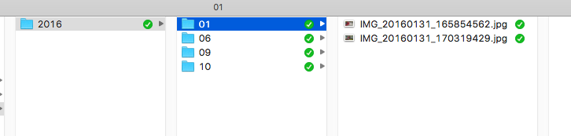

# OrganizeMediaFiles Alpha

This project is a collection of Python scripts that help to organize media
files into a directory tree "year/month" based on file metadata, using [exiftool](http://www.sno.phy.queensu.ca/~phil/exiftool/)

Used by me into my personal [Nextcloud](https://www.nextcloud.com) installation to organize unsorted files.
Strongly inspired by: https://github.com/OneLogicalMyth/Random-Scripts/blob/master/NextCloud/SortPictures.py

**Tested with Linux/Debian python 2 and MacOS python 2 and 3**

**ATTENTION alpha version backup your files before use!**

This picture describe the final result:

## Features
+ manages duplicate files due to milliseconds difference (the new file uses the same old name).
+ support all file types supported by [exiftool](http://www.sno.phy.queensu.ca/~phil/exiftool/)
+ proccess video and photo at same time (see `config.json`)
+ if exists, add sub second time original (fraction of seconds) to file name

## Getting OrganizeMediaFiles:
Clone the repository: `git clone https://github.com/vpistis/OrganizeMediaFiles.git`.
Alternatively download [tarball](https://github.com/vpistis/OrganizeMediaFiles/tarball/master) or [zip](https://github.com/vpistis/OrganizeMediaFiles/archive/master.zip). There haven't been any releases yet.

## Installation
No installation required, it's a simple python script :) It run in `python`.

## Requirements
Install [exiftool](http://www.sno.phy.queensu.ca/~phil/exiftool/) commandline:
`sudo apt-get install exiftool`

## Usage
Configure using `config.json` and run with python:
`python organize_media_files.py`

## Configuration
**Important**: process only photo/video (and maybe audio) files with specified extensions.
Use the `config.json` to change paths and other stuff.

### LOG_FILE
Default: `"LOG_FILE": "organize_media_files.log"`.
Where is placed the log file.
### RENAME_SORTED_FILES
Default: `"RENAME_SORTED_FILES": false`.
If `true` rename sorted files according to metadata creation time.
See `DATE_FORMAT_OUTPUT` for the name of new file.
### REMOVE_OLD_FILES
Default: `"REMOVE_OLD_FILES": false`.
If `true` delete old file after creation of new processed file.
### APPEND_ORIG_FILENAME
Default: `"APPEND_ORIG_FILENAME": false`.
If `true` append the original file name at the end of new created file.
### DATE_FORMAT_OUTPUT
Default: `"DATE_FORMAT_OUTPUT": "%Y%m%d_%H%M%S"`.
The date output string in python used to name the new created file.
Used only if `RENAME_SORTED_FILE=true`.
### PROCESS_IMAGES
Default: `"PROCESS_IMAGES": true`.
If `true` process image files according to the `IMAGE_FILES_EXTENSIONS`.
### IMAGE_FILENAME_SUFFIX
Default: `"IMAGE_FILENAME_SUFFIX": "IMG_"`.
Prepend this string to the new created file name.
### IMAGES_SOURCE_PATH
Default: `"IMAGES_SOURCE_PATH": "/media/drivemount/user/files/FilesToSort"`.
The path where original image files are stored.
### IMAGES_DESTINATION_PATH
Default: `"IMAGES_DESTINATION_PATH": "/media/drivemount/user/files/FilesSorted"`.
The root path where store the new organized image files.
### IMAGE_FILES_EXTENSIONS
Default: `"IMAGE_FILES_EXTENSIONS": [".jpg",".gif",".tiff"]`.
Files with these extensions are processed as images (NOTE: exiftool support internally many file types, and the command used in this script is the same for images/videos)
### PROCESS_VIDEOS
Default: `"PROCESS_VIDEOS": false`.
If `true` process video files according to the `VIDEO_FILES_EXTENSIONS`.
### VIDEO_FILENAME_SUFFIX
Default: `"VIDEO_FILENAME_SUFFIX": "VID_"`.
Prepend this string to the new created file name.
### VIDEOS_SOURCE_PATH
Default: `"VIDEOS_SOURCE_PATH": "/media/drivemount/user/files/FilesToSort"`
The path where original video files are stored.
### VIDEOS_DESTINATION_PATH
Default: `"VIDEOS_DESTINATION_PATH": "/media/drivemount/user/files/FilesSorted"`.
The root path where store the new organized video files.
### VIDEO_FILES_EXTENSIONS
Default: `"VIDEO_FILES_EXTENSIONS": [".mp4",".3gp"]`.
Files with these extensions are processed as videos see [IMAGE_FILES_EXTENSIONS](#image_files_extensions) note.
### NEXTCLOUD
Default: `"NEXTCLOUD": false`.
If `true` exec nextcloud command to rescan data directory for new files.
### NEXTCLOUD_PATH
Default: `"NEXTCLOUD_PATH": "/var/www/html/nextcloud"`.
The path of nextcloud installation.
### NEXTCLOUD_USER
Default: `"NEXTCLOUD_USER": "www-data"`
Launch nextcloud scan command as a `"NEXTCLOUD_USER"`.
# LICENSE
MIT License

Copyright (c) 2016 Valentino Pistis

Permission is hereby granted, free of charge, to any person obtaining a copy
of this software and associated documentation files (the "Software"), to deal
in the Software without restriction, including without limitation the rights
to use, copy, modify, merge, publish, distribute, sublicense, and/or sell
copies of the Software, and to permit persons to whom the Software is
furnished to do so, subject to the following conditions:

The above copyright notice and this permission notice shall be included in all
copies or substantial portions of the Software.

THE SOFTWARE IS PROVIDED "AS IS", WITHOUT WARRANTY OF ANY KIND, EXPRESS OR
IMPLIED, INCLUDING BUT NOT LIMITED TO THE WARRANTIES OF MERCHANTABILITY,
FITNESS FOR A PARTICULAR PURPOSE AND NONINFRINGEMENT. IN NO EVENT SHALL THE
AUTHORS OR COPYRIGHT HOLDERS BE LIABLE FOR ANY CLAIM, DAMAGES OR OTHER
LIABILITY, WHETHER IN AN ACTION OF CONTRACT, TORT OR OTHERWISE, ARISING FROM,
OUT OF OR IN CONNECTION WITH THE SOFTWARE OR THE USE OR OTHER DEALINGS IN THE
SOFTWARE.
